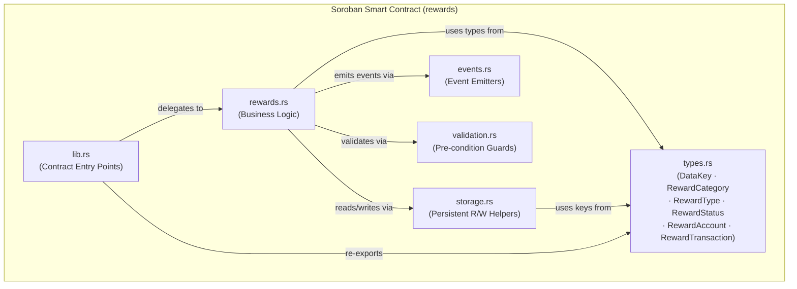
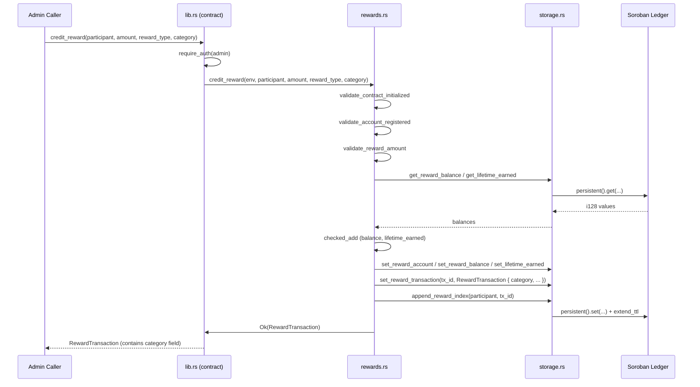

# Design Document: Reward Categories

## Overview

The reward categories feature introduces a `RewardCategory` enum into the StellarSpend rewards contract so that every reward transaction is classified at the point of issuance. This gives the protocol a first-class way to distinguish why a reward was earned (e.g. staying within a budget vs. completing a savings goal vs. a promotional campaign), enabling accurate reporting, per-category analytics, and targeted future campaigns — all without changing the ledger storage layout in a breaking way.

The change is deliberately additive: `RewardCategory` is added as a new field on `RewardTransaction` and threaded through the call-chain (`credit_reward` / `debit_reward` → `RewardTransaction`). No existing storage keys are removed or retyped; pre-existing records that lack a category will surface a default value (`RewardCategory::Other`) at read-time via `unwrap_or`.

The five required categories — `BudgetReward`, `SavingsReward`, `SpendingReward`, `BonusReward`, and `PromotionalReward` — cover every business scenario described in the requirements. An `Other` variant is included as a safe default for forward-compatibility.

---

## Architecture



The architecture is unchanged in structure. `RewardCategory` is a new `#[contracttype]` enum that lives in `types.rs` alongside the existing `RewardType` and `RewardStatus` enums. It propagates outward through the call-chain:



---

## Components and Interfaces

### Component 1: `types.rs` — Data Types

**Purpose**: Defines all on-chain data structures and storage keys. `RewardCategory` is added here as a new `#[contracttype]` enum and wired into `RewardTransaction`.

**New type — `RewardCategory`**:

```rust
/// Classifies the campaign or behaviour that triggered a reward.
///
/// Stored on every [`RewardTransaction`] so analytics and reporting can
/// break down earned points by category without needing off-chain enrichment.
#[contracttype]
#[derive(Clone, Debug, Eq, PartialEq)]
pub enum RewardCategory {
    /// Reward issued for responsible budget management (staying within limits).
    BudgetReward,
    /// Reward issued for reaching or maintaining a savings goal.
    SavingsReward,
    /// Reward issued as a cashback or incentive on eligible spending.
    SpendingReward,
    /// Reward issued as a bonus (e.g., sign-up bonus, milestone bonus).
    BonusReward,
    /// Reward issued as part of a limited-time promotional campaign.
    PromotionalReward,
    /// Catch-all for any future category not yet enumerated.
    Other,
}
```

**Updated struct — `RewardTransaction`**:

```rust
#[contracttype]
#[derive(Clone, Debug)]
pub struct RewardTransaction {
    pub id: u64,
    pub recipient: Address,
    pub amount: i128,
    pub reward_type: RewardType,
    /// NEW — category of this reward transaction.
    pub category: RewardCategory,
    pub status: RewardStatus,
    pub created_at: u64,
    pub updated_at: u64,
}
```

**Responsibilities**:
- Be the single source of truth for all on-chain types.
- Export `RewardCategory` so `lib.rs` can re-export it to callers.
- Keep `RewardTransaction` fully `#[contracttype]`-compatible (all fields must implement `IntoVal`/`FromVal`).

---

### Component 2: `rewards.rs` — Business Logic

**Purpose**: Implements `credit_reward` and `debit_reward`. Both functions gain a `category: RewardCategory` parameter that is stored verbatim on the `RewardTransaction` record.

**Updated function signatures**:

```rust
pub fn credit_reward(
    env: &Env,
    participant: &Address,
    amount: i128,
    reward_type: RewardType,
    category: RewardCategory,         // NEW
) -> Result<RewardTransaction, RewardsError>

pub fn debit_reward(
    env: &Env,
    participant: &Address,
    amount: i128,
    reward_type: RewardType,
    category: RewardCategory,         // NEW
) -> Result<RewardTransaction, RewardsError>
```

**Responsibilities**:
- Accept and validate inputs (no additional validation needed for `category` — every variant is legal).
- Construct `RewardTransaction` with the supplied `category`.
- Delegate all storage writes to `storage.rs`.
- Emit events unchanged (category is visible in the returned `RewardTransaction`).

---

### Component 3: `lib.rs` — Contract Entry Points

**Purpose**: The public-facing Soroban contract. Both `credit_reward` and `debit_reward` entry points gain the `category` parameter and forward it to `rewards.rs`.

**Updated entry point signatures**:

```rust
pub fn credit_reward(
    env: Env,
    participant: Address,
    amount: i128,
    reward_type: RewardType,
    category: RewardCategory,         // NEW
) -> RewardTransaction

pub fn debit_reward(
    env: Env,
    participant: Address,
    amount: i128,
    reward_type: RewardType,
    category: RewardCategory,         // NEW
) -> RewardTransaction
```

**Responsibilities**:
- Re-export `RewardCategory` in the `pub use` block alongside the existing type exports.
- Enforce admin auth before delegating.
- Surface `RewardsError` via `panic_with_error!` as today.

---

### Component 4: `storage.rs` — Persistent Storage Helpers

**Purpose**: Reads and writes `RewardTransaction` records. Because the storage format is determined by `#[contracttype]` serialization, no helper signatures change — the updated `RewardTransaction` struct is serialized/deserialized automatically by the Soroban SDK.

**No signature changes required.** The existing helpers continue to work:

```rust
pub fn get_reward_transaction(env: &Env, id: u64) -> Option<RewardTransaction>
pub fn set_reward_transaction(env: &Env, id: u64, tx: &RewardTransaction)
```

**Responsibilities**:
- Transparently persist and retrieve the updated `RewardTransaction` struct.
- Continue bumping TTL on every access.

---

### Component 5: `events.rs` — Event Emitters

**Purpose**: Emits observable events for off-chain indexers. The category is accessible through the returned `RewardTransaction` and does not require separate event fields — the existing event payloads remain stable, preserving compatibility with existing indexers.

**No changes required.** The existing emitters are sufficient:

```rust
pub fn emit_reward_credited(env: &Env, participant: &Address, amount: i128, tx_id: u64)
pub fn emit_reward_debited(env: &Env, participant: &Address, amount: i128, tx_id: u64)
```

Off-chain consumers can fetch `RewardTransaction` by `tx_id` to inspect the `category`.

---

## Data Models

### `RewardCategory` (new)

| Variant | Description |
|---|---|
| `BudgetReward` | Issued for staying within a spending budget |
| `SavingsReward` | Issued for reaching or sustaining a savings goal |
| `SpendingReward` | Cashback or incentive on eligible spend |
| `BonusReward` | Sign-up, milestone, or referral bonus |
| `PromotionalReward` | Time-limited promotional campaign reward |
| `Other` | Forward-compatibility catch-all |

**Validation rules**:
- Every variant is unconditionally valid — no validation guard needed.
- Callers must supply an explicit variant; there is no implicit default (the `Other` variant is the explicit opt-out).

### `RewardTransaction` (updated)

| Field | Type | Change | Notes |
|---|---|---|---|
| `id` | `u64` | unchanged | Monotonically incrementing |
| `recipient` | `Address` | unchanged | The rewarded participant |
| `amount` | `i128` | unchanged | Positive, in stroops |
| `reward_type` | `RewardType` | unchanged | Mechanism of issuance |
| `category` | `RewardCategory` | **NEW** | Business classification |
| `status` | `RewardStatus` | unchanged | `Confirmed` / `Claimed` |
| `created_at` | `u64` | unchanged | Ledger sequence |
| `updated_at` | `u64` | unchanged | `0` until status changes |

---

## Algorithmic Pseudocode

### Main Flow: `credit_reward` with Category

```rust
// ALGORITHM: credit_reward
// INPUT:  env, participant: &Address, amount: i128,
//         reward_type: RewardType, category: RewardCategory
// OUTPUT: Result<RewardTransaction, RewardsError>
//
// PRECONDITIONS:
//   - contract is initialized (Initialized key in instance storage)
//   - participant has a registered RewardAccount
//   - amount > 0
//
// POSTCONDITIONS:
//   - reward_balance(participant) == old_balance + amount
//   - lifetime_earned(participant) == old_lifetime + amount
//   - RewardTransaction { category, status: Confirmed } written to storage
//   - tx_id appended to RewardIndex(participant)
//   - reward_tx_counter incremented by 1
//   - "reward_credited" event emitted
//
// LOOP INVARIANTS: N/A (no iteration)

fn credit_reward(env, participant, amount, reward_type, category):
    validate_contract_initialized(env)?          // guard: Initialized key present
    validate_account_registered(env, participant)? // guard: RewardAccount key present
    validate_reward_amount(amount)?              // guard: amount > 0

    current_balance  = get_reward_balance(env, participant)   // i128, default 0
    current_lifetime = get_lifetime_earned(env, participant)  // i128, default 0

    new_balance  = current_balance.checked_add(amount)   // panic on overflow
    new_lifetime = current_lifetime.checked_add(amount)  // panic on overflow

    now = env.ledger().sequence() as u64

    account = get_reward_account(env, participant)?      // Option → Result
    account.balance          = new_balance
    account.lifetime_earned  = new_lifetime
    account.last_updated     = now

    set_reward_account(env, participant, account)        // write back metadata
    set_reward_balance(env, participant, new_balance)    // write scalar balance
    set_lifetime_earned(env, participant, new_lifetime)  // write scalar lifetime

    tx_id = get_reward_tx_counter(env)                   // u64, default 0

    tx = RewardTransaction {
        id:          tx_id,
        recipient:   participant.clone(),
        amount,
        reward_type,
        category,                                        // ← category stored here
        status:      RewardStatus::Confirmed,
        created_at:  now,
        updated_at:  0,
    }

    set_reward_transaction(env, tx_id, tx)               // persist full record
    set_reward_tx_counter(env, tx_id + 1)                // advance counter
    append_reward_index(env, participant, tx_id)          // index for history lookup

    emit_reward_credited(env, participant, amount, tx_id) // event

    return Ok(tx)
```

### Query Flow: Transaction History with Category

```rust
// ALGORITHM: get_transactions_for (read-only, existing entry point)
// INPUT:  env, participant: Address
// OUTPUT: Vec<u64>  — ordered list of tx IDs
//
// PRECONDITIONS: none (returns empty vec if no account)
// POSTCONDITIONS:
//   - returned Vec contains all tx IDs ever credited to participant, in order
//   - each ID can be resolved to RewardTransaction (which now contains category)

fn get_transactions_for(env, participant):
    ids = get_reward_index(env, participant)    // Vec<u64>, empty if none
    return ids

// Caller then resolves per-ID (off-chain or in a subsequent call):
//   tx = get_reward_transaction(env, id)
//   category = tx.category    ← available in every record
```

---

## Key Functions with Formal Specifications

### `credit_reward` (rewards.rs)

```rust
pub fn credit_reward(
    env: &Env,
    participant: &Address,
    amount: i128,
    reward_type: RewardType,
    category: RewardCategory,
) -> Result<RewardTransaction, RewardsError>
```

**Preconditions:**
- `env.storage().instance().has(DataKey::Initialized)` is `true`
- `env.storage().persistent().has(DataKey::RewardAccount(participant))` is `true`
- `amount > 0`

**Postconditions:**
- `get_reward_balance(env, participant) == old_balance + amount`
- `get_lifetime_earned(env, participant) == old_lifetime_earned + amount`
- `get_reward_transaction(env, tx_id).unwrap().category == category`
- `get_reward_transaction(env, tx_id).unwrap().status == RewardStatus::Confirmed`
- `get_reward_index(env, participant).last() == Some(tx_id)`
- `get_reward_tx_counter(env) == old_counter + 1`

**Loop Invariants:** N/A

---

### `debit_reward` (rewards.rs)

```rust
pub fn debit_reward(
    env: &Env,
    participant: &Address,
    amount: i128,
    reward_type: RewardType,
    category: RewardCategory,
) -> Result<RewardTransaction, RewardsError>
```

**Preconditions:**
- Contract is initialized
- `RewardAccount(participant)` exists
- `amount > 0`
- `get_reward_balance(env, participant) >= amount`

**Postconditions:**
- `get_reward_balance(env, participant) == old_balance - amount`
- `get_lifetime_claimed(env, participant) == old_lifetime_claimed + amount`
- `get_reward_transaction(env, tx_id).unwrap().category == category`
- `get_reward_transaction(env, tx_id).unwrap().status == RewardStatus::Claimed`
- `get_reward_tx_counter(env) == old_counter + 1`

**Loop Invariants:** N/A

---

### `RewardCategory` (types.rs)

```rust
#[contracttype]
#[derive(Clone, Debug, Eq, PartialEq)]
pub enum RewardCategory {
    BudgetReward,
    SavingsReward,
    SpendingReward,
    BonusReward,
    PromotionalReward,
    Other,
}
```

**Preconditions:** None — all variants are valid inputs.

**Postconditions:**
- Any `RewardCategory` value round-trips through `#[contracttype]` serialization without loss.
- A `RewardTransaction` carrying any variant stores and retrieves the same variant (`category_in == category_out`).

---

## Example Usage

```rust
// ── Example 1: Credit a BudgetReward ──────────────────────────────────────
// Admin credits 500 points to "alice" because she stayed under her monthly budget.

let tx = client.credit_reward(
    &alice,
    &500_i128,
    &RewardType::SpendingLimit,
    &RewardCategory::BudgetReward,
);
assert_eq!(tx.category, RewardCategory::BudgetReward);
assert_eq!(tx.status,   RewardStatus::Confirmed);
assert_eq!(tx.amount,   500);

// ── Example 2: Credit a PromotionalReward ────────────────────────────────
// Admin issues a promotional campaign bonus.

let tx = client.credit_reward(
    &bob,
    &1_000_i128,
    &RewardType::ManualGrant,
    &RewardCategory::PromotionalReward,
);
assert_eq!(tx.category, RewardCategory::PromotionalReward);

// ── Example 3: Query transaction history with category ────────────────────
// Off-chain indexer fetches all tx IDs then inspects each category.

let ids: Vec<u64> = client.get_transactions_for(&alice);
for id in ids.iter() {
    let record: RewardTransaction = client.get_reward_transaction(&id).unwrap();
    // record.category is now always present on every transaction
    match record.category {
        RewardCategory::BudgetReward      => { /* bucket into budget reporting */ }
        RewardCategory::SavingsReward     => { /* bucket into savings reporting */ }
        RewardCategory::SpendingReward    => { /* bucket into spend reporting */ }
        RewardCategory::BonusReward       => { /* bucket into bonus reporting */ }
        RewardCategory::PromotionalReward => { /* bucket into promo reporting */ }
        RewardCategory::Other             => { /* legacy / unknown */ }
    }
}

// ── Example 4: Debit a SavingsReward (claim) ─────────────────────────────
// Participant claims their savings reward.

let tx = client.debit_reward(
    &alice,
    &200_i128,
    &RewardType::SavingsGoal,
    &RewardCategory::SavingsReward,
);
assert_eq!(tx.category, RewardCategory::SavingsReward);
assert_eq!(tx.status,   RewardStatus::Claimed);
```

---

## Correctness Properties

*A property is a characteristic or behavior that should hold true across all valid executions of a system — essentially, a formal statement about what the system should do. Properties serve as the bridge between human-readable specifications and machine-verifiable correctness guarantees.*

### Property 1: RewardCategory Serialisation Round-Trip

*For any* `RewardCategory` variant, serialising the variant using the Soroban `#[contracttype]` XDR codec and then deserialising the result SHALL produce a value equal to the original variant.

**Validates: Requirements 1.4**

---

### Property 2: Credit Category Preservation

*For any* registered participant, positive amount, `RewardType`, and `RewardCategory` variant `c`, calling `credit_reward` with those arguments SHALL return and persistently store a `RewardTransaction` whose `category` field equals `c`.

**Validates: Requirements 2.3, 3.3, 3.4, 3.5, 3.6, 3.7, 3.8, 3.9, 3.10**

---

### Property 3: Debit Category Preservation

*For any* registered participant with sufficient balance, positive amount within that balance, `RewardType`, and `RewardCategory` variant `c`, calling `debit_reward` with those arguments SHALL return and persistently store a `RewardTransaction` whose `category` field equals `c` and whose `status` equals `RewardStatus::Claimed`.

**Validates: Requirements 4.3, 4.4, 4.5**

---

### Property 4: Credit Balance Invariance Across Categories

*For any* registered participant, positive amount, and `RewardCategory` variant, calling `credit_reward` SHALL increase `reward_balance(participant)` by exactly `amount` and increase `lifetime_earned(participant)` by exactly `amount`, regardless of the category supplied.

**Validates: Requirements 5.1, 5.2**

---

### Property 5: Debit Balance Invariance Across Categories

*For any* registered participant whose current balance is at least `amount`, positive amount, and `RewardCategory` variant, calling `debit_reward` SHALL decrease `reward_balance(participant)` by exactly `amount` and increase `lifetime_claimed(participant)` by exactly `amount`, regardless of the category supplied.

**Validates: Requirements 5.3, 5.4**

---

### Property 6: Transaction Index Append on Credit

*For any* registered participant and valid `credit_reward` call (any category), the length of `get_reward_index(participant)` SHALL increase by exactly 1 and the last element SHALL equal the `tx_id` of the new `RewardTransaction`.

**Validates: Requirements 6.3, 7.1, 7.3**

---

### Property 7: Transaction Counter Increment

*For any* successful `credit_reward` or `debit_reward` call with any `RewardCategory` variant, the reward transaction counter SHALL increase by exactly 1, ensuring each new `RewardTransaction` receives a unique, monotonically incrementing ID.

**Validates: Requirements 7.1, 7.2, 7.3**

---

### Property 8: History Resolves to Correct Category

*For any* sequence of `credit_reward` calls each with a distinct `RewardCategory` variant, every `tx_id` returned by `get_transactions_for(participant)` SHALL resolve via `get_reward_transaction(tx_id)` to a `RewardTransaction` whose `category` matches the variant supplied in the corresponding call.

**Validates: Requirements 6.1, 6.2**

---

### Property 9: Invalid Amount Rejected Regardless of Category

*For any* `RewardCategory` variant and any `amount` that is zero or negative, calling `credit_reward` SHALL return `RewardsError::InvalidAmount`, and no storage state SHALL be mutated.

**Validates: Requirements 8.4**

---

### Property 10: Insufficient Balance Rejected Regardless of Category

*For any* `RewardCategory` variant and any `amount` that exceeds the participant's current claimable balance, calling `debit_reward` SHALL return `RewardsError::InsufficientBalance`, and no storage state SHALL be mutated.

**Validates: Requirements 8.5**

---

## Error Handling

### Existing Errors — Unchanged

All existing `RewardsError` variants (`NotInitialized`, `Unauthorized`, `AlreadyInitialized`, `AccountAlreadyRegistered`, `InvalidAmount`, `AccountNotFound`, `Overflow`, `InsufficientBalance`) are unchanged in meaning and numeric code.

### No New Error Variants Needed

`RewardCategory` requires no validation — every variant is a legitimate input. No new error code is introduced.

### Storage Layout Migration

| Scenario | Behaviour |
|---|---|
| Record written before this change is read back | Soroban `#[contracttype]` uses XDR encoding; adding a field to a struct is a breaking change to the serialised layout. Existing records will fail to deserialise into the updated `RewardTransaction`. Callers should handle `None` from `get_reward_transaction` gracefully. |
| New record written with any `RewardCategory` variant | Round-trips correctly. |

> **Recommendation**: Since this is a new contract feature (no mainnet data at risk), deploy to a fresh contract instance or clear all `RewardTransaction` persistent entries before deploying the updated binary.

---

## Testing Strategy

### Unit Testing Approach

Each new code path in `rewards.rs` and `lib.rs` should be covered by test cases in the existing `test.rs` file (Soroban testutils pattern).

Key test cases to add:
- `credit_reward` with each of the five required categories stores the correct category on the returned `RewardTransaction`.
- `debit_reward` with each category stores the correct category.
- `get_transactions_for` returns IDs whose resolved `RewardTransaction` records carry the expected categories.
- Category field does not affect balance calculations (property: credits sum correctly regardless of category).

### Property-Based Testing Approach

**Property Test Library**: `proptest` (Rust)

Key properties:
- **Category preservation**: For any `(amount, category)` pair, `credit_reward` returns a `RewardTransaction` where `tx.category == category`.
- **Balance invariance**: `credit_reward` with any category increases `reward_balance` by exactly `amount`, independent of category.
- **Index consistency**: The length of `get_reward_index(participant)` increases by exactly 1 on every successful credit, regardless of category.

### Integration Testing Approach

- Deploy updated contract, register an account, issue one transaction per category, then iterate `get_transactions_for` and assert each category appears exactly once.
- Verify that mixing categories across multiple credits produces a history in which each `RewardTransaction.category` matches the originally-supplied value.

---

## Performance Considerations

- `RewardCategory` is a unit enum with six variants — its XDR-serialised size is a single `u32` discriminant (4 bytes). The addition to `RewardTransaction` increases per-record storage by 4 bytes, which is negligible relative to the existing struct size.
- No additional storage keys, reads, or writes are introduced.
- TTL bump logic in `storage.rs` is unaffected.

---

## Security Considerations

- `RewardCategory` carries no privilege — it is metadata only. The admin auth check on `credit_reward` / `debit_reward` is unchanged and continues to be the sole access gate.
- No category value allows bypassing balance or overflow checks.
- The `Other` variant provides a safe escape hatch without opening an unbounded string field that could be misused for injection or oversized payloads.

---

## Dependencies

| Dependency | Version | Notes |
|---|---|---|
| `soroban-sdk` | `=22.0.0` | Workspace-pinned; `#[contracttype]` derives all required traits |

No new external dependencies are required. The feature is implemented entirely within the existing `rewards` crate using traits and macros already available from the pinned `soroban-sdk`.
